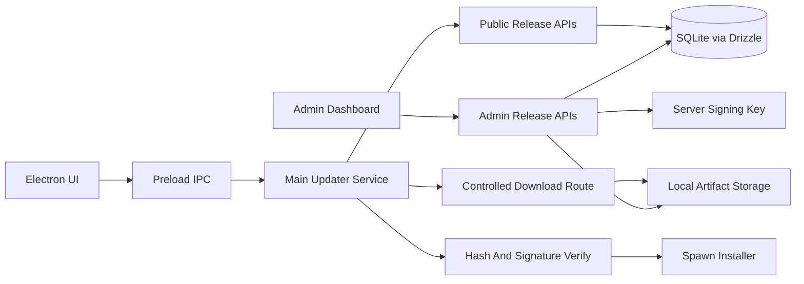

# Secure Update POC Plan

## Phase 1: Server Persistence

-   Add Drizzle + SQLite to [`web`](web): `drizzle-orm`, `better-sqlite3`, `drizzle-kit`.
-   Create schema for `releases`, `release_files`, `update_logs` in [`web/lib/db`](web/lib/db).
-   Store DB at [`web/data/update-server.sqlite`](web/data/update-server.sqlite); add [`web/data`](web/data) to gitignore.
-   Keep current API shapes stable, but replace [`web/lib/store.ts`](web/lib/store.ts) reads/writes with DB queries.
-   Add seed/migration scripts so dashboard has data after setup.

## Phase 2: Artifact Storage

-   Move uploads from [`web/public/uploads`](web/public/uploads) to [`web/storage/releases`](web/storage/releases); gitignore [`web/storage`](web/storage).
-   On upload in [`web/app/api/admin/releases/[id]/upload/route.ts`](web/app/api/admin/releases/[id]/upload/route.ts): validate platform/file type, write file outside `public`, compute SHA-256, size, MIME-ish metadata.
-   Add signature metadata fields: `sha256`, `signature`, `signatureAlgorithm`, `signedAt`, optional `signingKeyId`.
-   Serve artifacts through a controlled route, not static public files.

## Phase 3: Release API Contract

-   Update public APIs in [`web/app/api/releases/latest/route.ts`](web/app/api/releases/latest/route.ts), [`web/app/api/releases/[version]/route.ts`](web/app/api/releases/[version]/route.ts), and [`web/app/api/releases/download/[id]/route.ts`](web/app/api/releases/download/[id]/route.ts).
-   Return only enabled releases with a platform file and include verification metadata.
-   Use Zod schemas for request params, query params, admin JSON bodies, log bodies, and upload fields.
-   Use safe file serving: path normalization, no traversal, exact DB-backed file lookup, stream response, increment download count after accepted request.

## Phase 4: Signing Model

-   Use detached Ed25519 signatures for POC.
-   Server signs a canonical payload containing version, platform, fileName, fileSize, sha256, and release id.
-   Private key stays server-side via env/path; public key is bundled in Electron.
-   Admin upload should fail or mark file unusable if signing is not configured.
-   Electron verifies both hash and signature before any install action.

## Phase 5: Electron Update Service

-   Add a main-process updater module under [`electron/src`](electron/src).
-   Use `VITE_SERVER_URL` or a main-process env/config value as update server base URL.
-   Add IPC methods in [`electron/src/main.ts`](electron/src/main.ts) and [`electron/src/preload.ts`](electron/src/preload.ts): `checkForUpdate`, `downloadAndInstallUpdate`, `onUpdateStatus`.
-   Detect platform, current `__APP_VERSION__`, request latest release, compare semver, and expose states: idle, checking, available, downloading, verifying, installing, failed, up-to-date.
-   Download into a temp/update cache dir, stream to disk, compute SHA-256 while downloading or immediately after.
-   Verify detached signature with bundled public key.
-   Spawn verified installer/package with `child_process.spawn`, detached where appropriate, then quit app only after install process starts.

## Phase 6: Electron UI

-   Replace placeholder [`electron/src/app.tsx`](electron/src/app.tsx) with a small update panel.
-   One button behavior: `Check for updates` -> if available, same primary action becomes `Install update`.
-   Show current version, latest version, release notes, progress/status, and verification/install errors.
-   Keep renderer untrusted: no direct filesystem or child process access; all update work stays in main process via typed preload API.

## Phase 7: Security Hardening

-   Add schema validation and narrow response objects on server routes.
-   Reject unexpected upload extensions and suspicious filenames; generate server-side stored names.
-   Never serve disabled releases or files not linked to enabled releases.
-   Keep private signing key and SQLite DB out of git.
-   Electron only trusts bundled public key, HTTPS server URL in production, exact sha256 match, valid signature, and expected platform.

## Phase 8: Verification

-   Run `pnpm lint` and `pnpm typecheck` in [`web`](web).
-   Run `pnpm lint` and `pnpm types:check` in [`electron`](electron).
-   Add focused tests/scripts if repo test setup exists or is added: hash/signature verification, API validation, path traversal rejection, updater state transitions.
-   Manual POC flow: create release, upload artifact, enable release, check from Electron, download, verify, spawn installer.

## Suggested Implementation Order

-   First: Phase 1 + Phase 2, because server state and artifact metadata unblock everything.
-   Next: Phase 3 + Phase 4, to lock the security contract.
-   Last: Phase 5 + Phase 6 + Phase 8, to wire Electron and test the POC end-to-end.
